# Pet Adoption App 

This Pet Adaption App is made On **Flutter** with **Firestore** Backend with 
HCI(Human Computer Interaction) componet implemnted With Google Map SDK

## Features

1. Login/Singup with Google SignUp
2. Post View,Edit and Delete
3. Post Favourite
4. Google Map Integration
5. Chat App
6. Pet Nutrition
7. Pet Vetenarion
8. Edit Profile
9. Contact Modal

## Images

  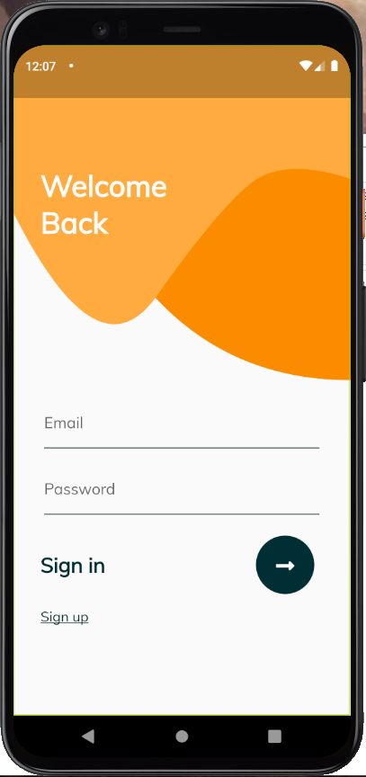
  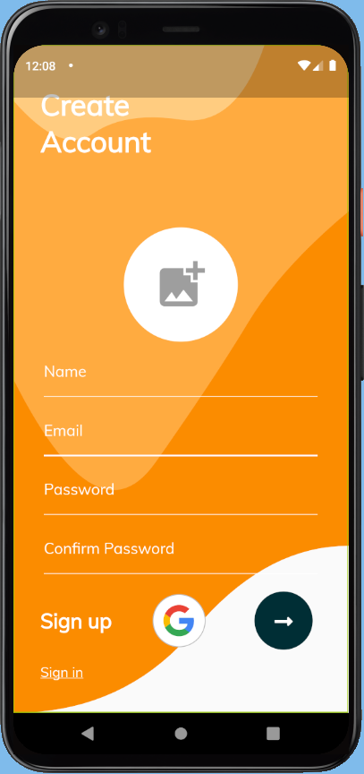
  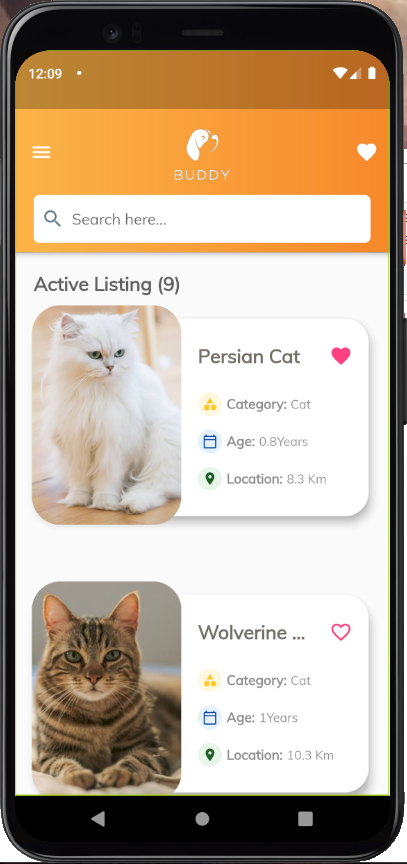
  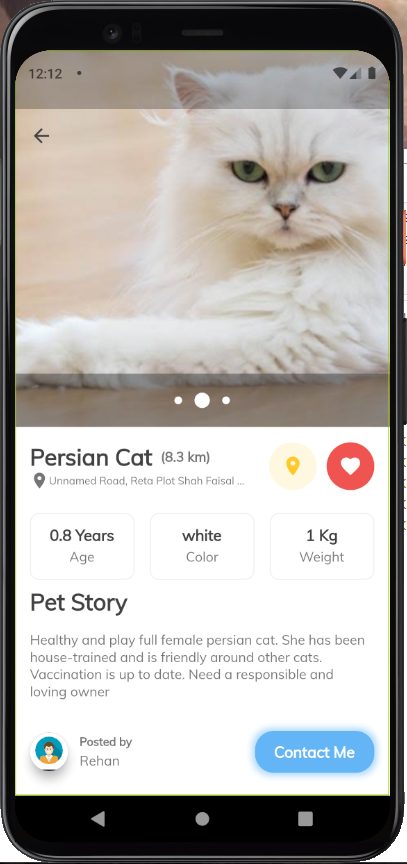
  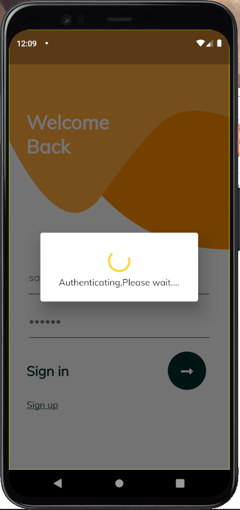
  
  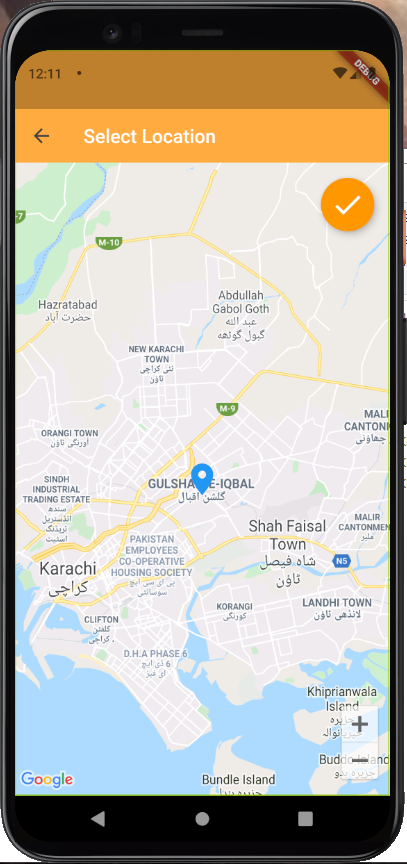
  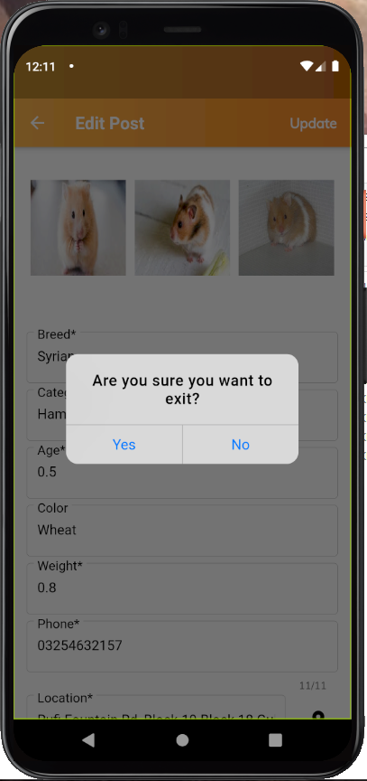
  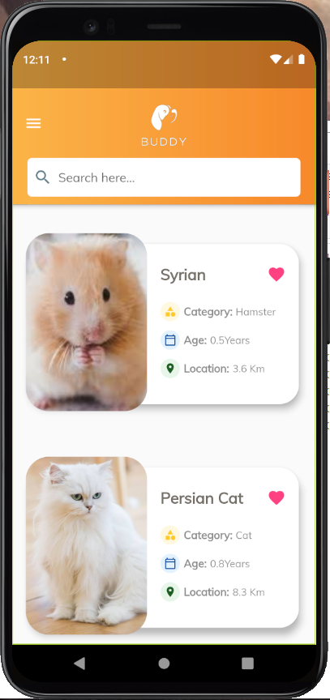
  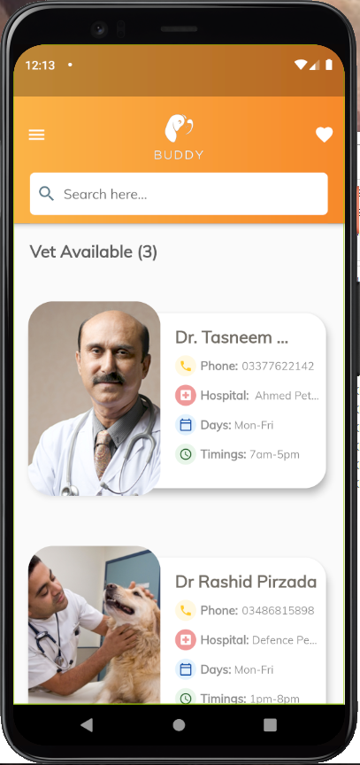
  
  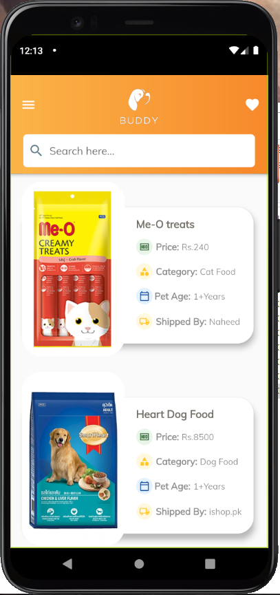
  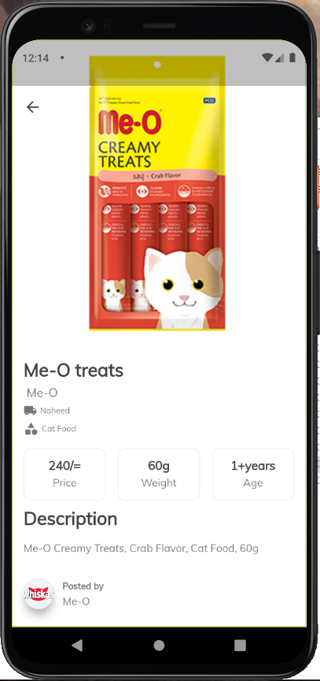
  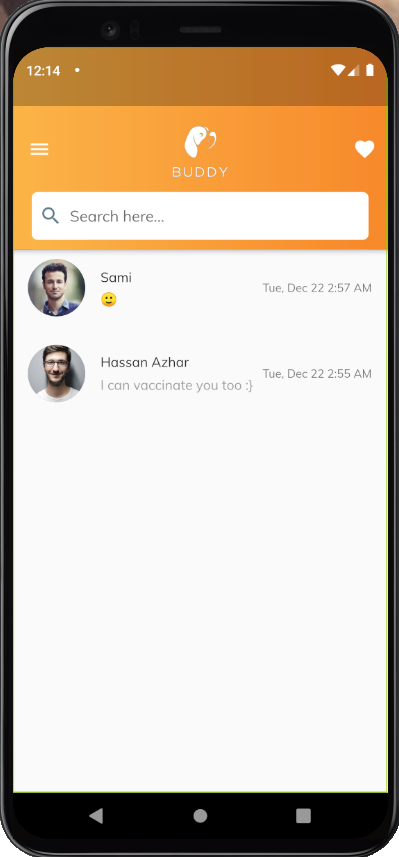
  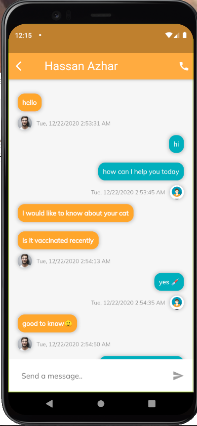
  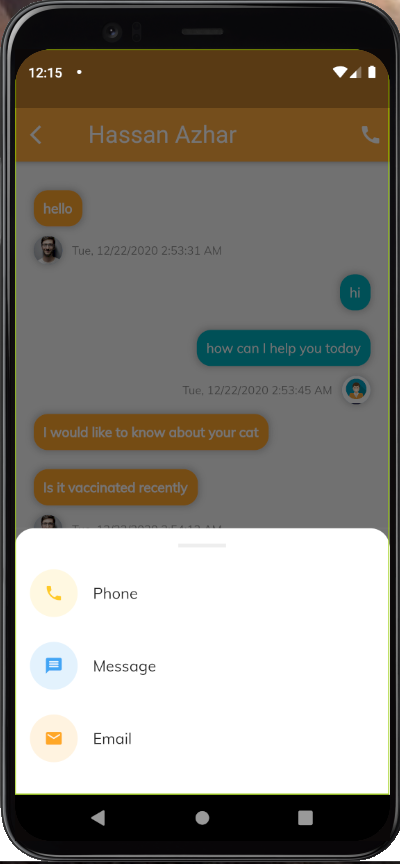
  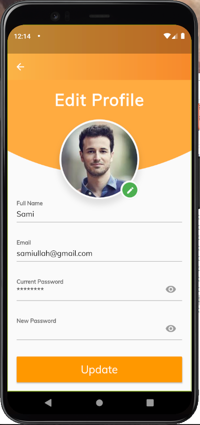

## Device Detail

Name: Pixel_4_API_28

CPU/ABI: Google Play Intel Atom (x86)

Target: google_apis_playstore [Google Play] (API level 28)

Skin: pixel_4

SD Card: 512 MB

fastboot.chosenSnapshotFile: 

runtime.network.speed: full

hw.accelerometer: yes

hw.device.name: pixel_4

hw.lcd.width: 1080

hw.initialOrientation: Portrait

image.androidVersion.api: 28

tag.id: google_apis_playstore

hw.mainKeys: no

hw.camera.front: emulated

avd.ini.displayname: Pixel 4 API 28

hw.gpu.mode: auto

hw.ramSize: 1536

PlayStore.enabled: true

fastboot.forceColdBoot: no

hw.cpu.ncore: 2

hw.keyboard: yes

hw.sensors.proximity: yes

hw.dPad: no

hw.lcd.height: 2280

vm.heapSize: 256

skin.dynamic: yes

hw.device.manufacturer: Google

hw.gps: yes

hw.audioInput: yes

image.sysdir.1: system-images\android-28\google_apis_playstore\x86\

showDeviceFrame: yes

hw.camera.back: virtualscene

AvdId: Pixel_4_API_28

hw.lcd.density: 440

hw.arc: false

hw.device.hash2: MD5:6b5943207fe196d842659d2e43022e20

fastboot.forceChosenSnapshotBoot: no

fastboot.forceFastBoot: yes

hw.trackBall: no

hw.battery: yes

hw.sdCard: yes

tag.display: Google Play

runtime.network.latency: none

disk.dataPartition.size: 6G

hw.sensors.orientation: yes

avd.ini.encoding: UTF-8

hw.gpu.enabled: yes